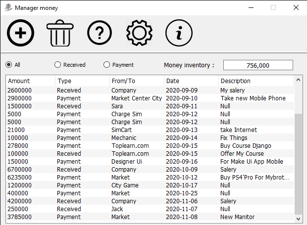
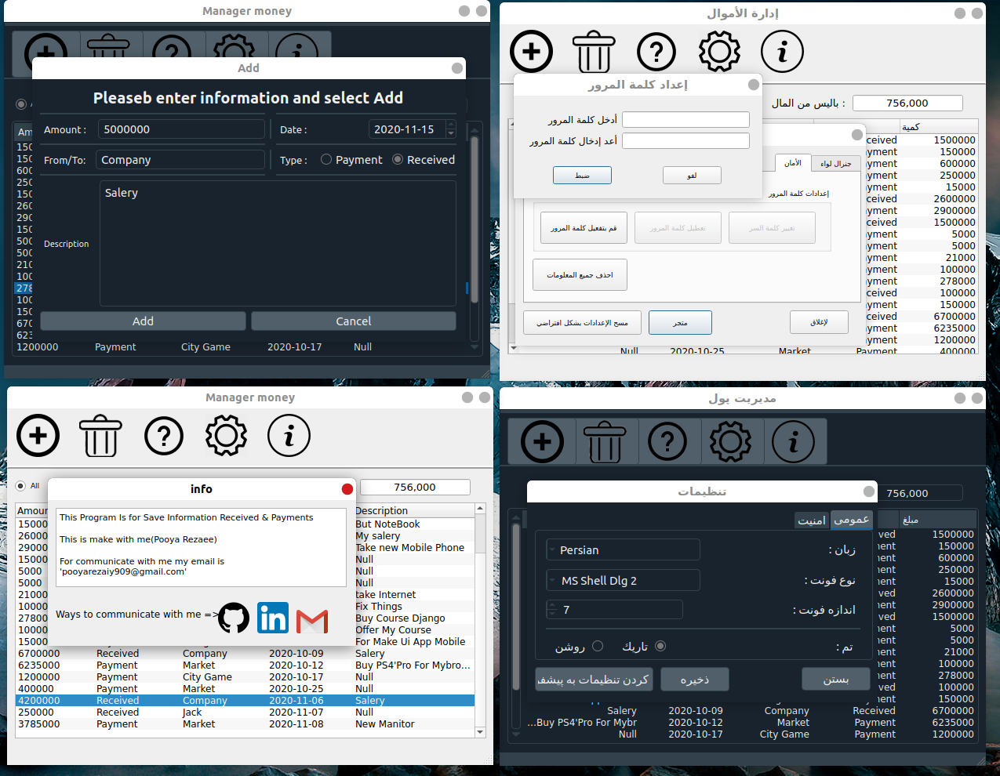

# Manager-Money
## Pictures from Programm
- 
- 


## What this ?
this is Programm for add submit your paymount or recived Money's

## Options :
- Two Them Dark And Light
- Supprot From 3 Language English,persian and Arabic
- set password
- change Font Type and Font Size
## Perpubies :
- Python3
- Lybrarys Python => qdarkstyle , PyQt5 , json , sqlite3

## How install LibrarysPython ?
```
python -m pip install qdarkstyle
python -m pip install pyqt5
python -m pip install json
python -m pip install sqlite3
```
## Install & Run :
```
git clone https://github.com/PooyaRezaee/Manager-Money.git
cd Manager-Money
python3 Main_Window.py
```

## TODO
- [ ] Fix or Report Bugs
- [ ] Add a Feature or tell Idea for the QuestionMark
